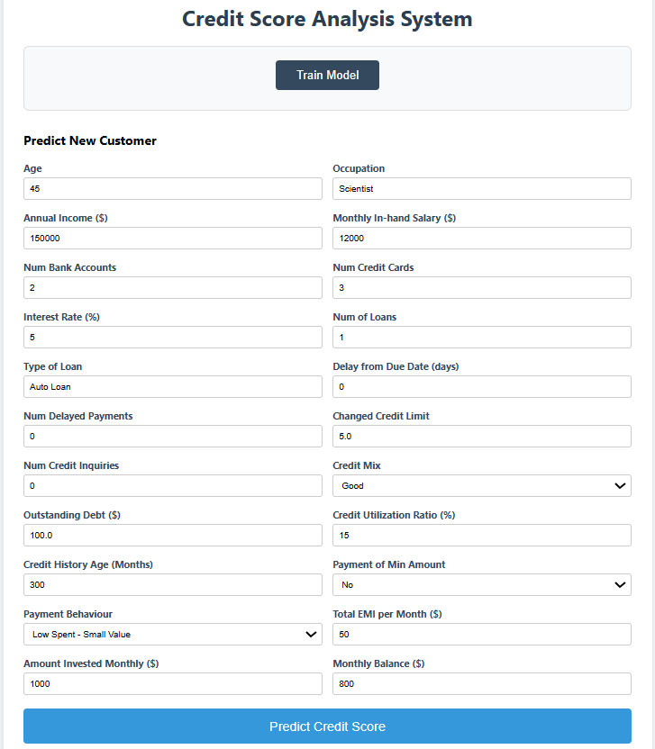
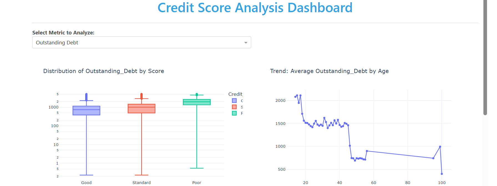
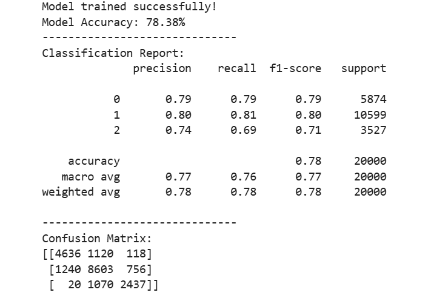

# Credit Score Classification System

An **end-to-end Machine Learning solution** designed to automate credit risk assessment.  
This project processes raw financial data and classifies customers into **Good**, **Standard**, or **Poor** credit tiers, deployed through a **production-ready Flask web application**.

---

## Features

- **Data Pipeline**
  - Advanced data cleaning and preprocessing
  - Handling mixed data types, missing values, outlier capping, and imputation

- **Machine Learning**
  - Random Forest Classifier optimized for robustness and accuracy
  - Feature importance analysis and performance evaluation

- **Interactive Web Application**
  - Flask-based backend with a user-friendly web interface
  - Real-time credit score prediction for new customer inputs

- **Advanced Analytics**
  - SQL-based analytical queries using **Window Functions**
  - Includes `RANK`, `LAG`, and `NTILE` for behavioral insights

- **Data Visualization**
  - Comprehensive Exploratory Data Analysis (EDA)
  - Visual insights using Matplotlib and Seaborn

---

## Tech Stack

- **Language:** Python 3.8+
- **Libraries:** Pandas, NumPy, Scikit-learn, Matplotlib, Seaborn
- **Web Framework:** Flask, Dash
- **Database & Analytics:** SQL
- **Model:** Random Forest Classifier

---

## Project Structure

```text
Credit_Score_Project/
├── templates/                    # HTML templates for the Flask web app
│   └── index.html
├── Analytical Queries.sql        # SQL analytical queries
├── app.py                        # Flask application entry point
├── Credit_Score_Project.ipynb    # Data cleaning, EDA, and model training notebook
├── CreditScore.csv               # Original dataset
├── Project Instructions.pdf      # Course project instructions
├── README.md                     # Project documentation
└── requirements.txt              # Python dependencies
```

---

## Getting Started

### Clone the Repository
```bash
git clone https://github.com/hadyelfadaly/Data-Visualization-Credit-Score-Project
cd Credit_Score_Project
pip install -r requirements.txt
```

---

## Model Training (Required)

> **Important:**  
> The trained machine learning model (`credit_score_model.pkl`) is **not included** in this repository due to file size constraints.

### To generate the model locally:

1. Open `Credit_Score_Project.ipynb` in Jupyter Notebook.
2. Run all cells related to:
   - Data cleaning
   - Feature engineering
   - Model training
3. The trained model will be saved as:
   ```text
   credit_score_model.pkl
   ```
4. Place the generated file in the project root directory.

---

## Run the Web Application

Once the model file is generated, run:

```bash
python app.py
```

Open your browser and navigate to: `http://127.0.0.1:5000/`

The application will load a web interface allowing real-time credit score predictions.

---

## Exploratory Data Analysis

The notebook includes:

- Credit score distribution analysis  
- Financial behavior pattern exploration  
- Feature relationship analysis  
- Outlier detection and handling  

All analysis is **fully reproducible** through the Jupyter Notebook.

---

## Model Evaluation

- Multi-class classification into **Good**, **Standard**, and **Poor**
- Model performance evaluated using:
  - Confusion Matrix
  - Feature Importance
  - Accuracy and robustness metrics

---

## SQL Analysis

In addition to the machine learning workflow, this project includes **SQL-based analytical queries** to extract business insights from the credit score dataset.

### Scope of SQL Analysis
- Data preparation for relational storage
- Analytical querying for customer behavior analysis
- Use of SQL to complement insights derived from Python-based EDA

### Key SQL Techniques Used
- **Window Functions**:
  - `RANK()` to rank customers based on financial metrics
  - `LAG()` to analyze changes in customer behavior over time
  - `NTILE()` to segment customers into groups
- **Aggregations** using `GROUP BY`
- **Filtering** and conditional logic
- **Joins** for relational data analysis

### Files Related to SQL Analysis
- `Analytical Queries.sql` — Contains advanced analytical SQL queries

### Insights Gained
- Identification of high-risk and low-risk customer segments
- Analysis of spending and repayment behavior patterns
- Ranking and segmentation of customers based on financial attributes

This SQL component enhances the project by demonstrating the ability to **translate analytical requirements into efficient SQL queries**, complementing the machine learning and visualization layers.

---

## Project Outputs

- Interactive web interface for credit score prediction  
- EDA visualizations highlighting financial trends  
- Model evaluation plots demonstrating classifier performance  

---

## Team Project

This project was developed as a **team assignment for the Data Visualization course at Cairo University 25/26 Fall Semester**.

---

## Final Notes

This project demonstrates a complete **data science workflow**, combining:

- Data preparation and quality assurance  
- Machine learning modeling  
- Analytical SQL  
- Application-level deployment  

It reflects **real-world, end-to-end problem solving** in a data-driven environment.

---

## Screenshots

### Web Application Interface


### Exploratory Data Analysis


### Model Evaluation


